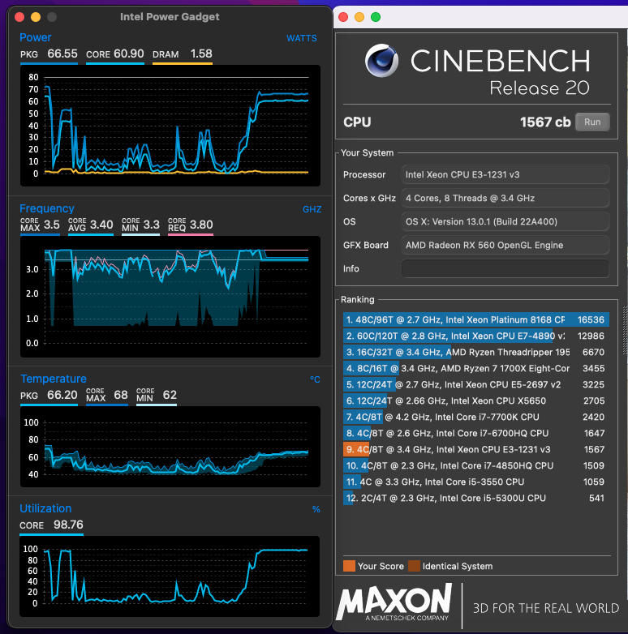

# MSI B85i Hackintosh OpenCore EFI

### [简体中文](README.zh_CN.md)

### OpenCore

[OpenCore 0.9.7](https://github.com/acidanthera/OpenCorePkg)

### OS Version Tested

- macOS Monterey 12.x
- macOS Ventura  13.x 

### Hardware

- Motherboard: MSI B85i
- Bios Version: E7851IMS V3.7
- CPU: Intel Xeon E3-1231 V3
- RAM: Samsung 2x4GB DDR3 1600
- SSD: Crucial MX300 275G
- eGPU: RX560 （Half Height Pcie Video Card）
- Audio: Realtek ALC892
- Ethernet Card: Realtek 8111G
- Wireless: BCM94360CS2 With MiniPcie Adapter Card
- PSU: DC-ATX With asus 180W Laptop AC Adapter  

### Notes
 - Use [OpenCore Configurator](https://mackie100projects.altervista.org/opencore-configurator/) build your own SMBIOS

### Bios Setup

| Name | Option |
| ----- | --- |
| Settings → Advanced → Integrated Peripherals → LAN Option ROM | Disabled |
| Settings → Advanced → Integrated Peripherals → Network stack | Disabled |
| Settings → Advanced → Integrated Peripherals → SATA Mode | AHCI Model |
| Settings → Advanced → Intel(R) Smart Connect Configuration → Intel (R) Smart connect Technology | Disabled |
| Settings → Advanced → Integrated Graphics Configuration → Initiate Graphic Adapter | PEG |
| Settings → Advanced → Integrated Graphics Configuration → IGD Multi-Monitor | Disabled |
| Settings → Advanced → Intel(R) Rapid Start Technology | Disabled |
| Settings → Advanced → USB Configuration → XHCI Hand-off | Enabled |
| Settings → Advanced → USB Configuration → EHCI Hand-off | Enabled |
| Settings → Advanced → Super I0 Configuration  → Serial(COM) Port0 | Disabled |
| Settings → Advanced → Power Management Setup | Disabled |
| Settings → Advanced → Windows 8/8.1 Configuration  → Windows 8/8.1 Feature | Disabled |
| Settings → Advanced → Windows 8/8.1 Configuration  → MSI Fast Boot | Disabled |
| Settings → Advanced → Windows 8/8.1 Configuration  → Fast Boot | Disabled |
| Settings → Advanced → Hake Up Event Setup  → Wake Up Event By | BIOS |
| Settings → Advanced → Hake Up Event Setup  → Resume By RTC Alarm | Disabled |
| Settings → Advanced → Hake Up Event Setup  → Resume By PCI-E Device | Disabled |
| Settings → Advanced → Hake Up Event Setup  → Resume From S3 by USB Device | Disabled |
| Settings → Advanced → Hake Up Event Setup  → Resume From S3/84/85 by PS/2 Mouse | Disabled |
| Settings → Advanced → Hake Up Event Setup  → Resume From S3/S4/85 by PS/2 keyboard | Disabled |
| Settings → Advanced → Hake Up Event Setup  → Resume By RTC Alarm | Disabled |
| Settings → Boot → Boot mode select | UEFI |
| Settings → Boot → UEFI Hard Disk Drive BBs Priorities  → Boot Option #1 | UEFI OS |
| Overclocking → CPU FeaturesBoot → Intel VT-D Tech | Disabled |
| Overclocking → CPU FeaturesBoot → CFG Lock | Disabled |

### ScreenShot 

- About This Mac

- Geekbench5 Score E3-1231 V3

- Intel Power Gadget and Cinebench R20

### Contact Us 

- QQ Group: 23304408

